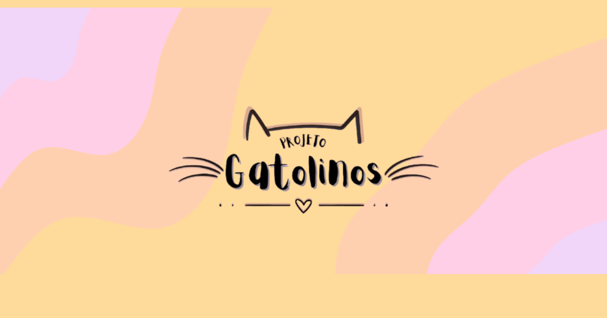

<p align="center">
  <a href="https://projetogatolinos.com.br">
    
  </a>
</p>

<h3 align="center">
  <a href="https://projetogatolinos.com.br">Site</a>
  <span> | </span>
  <a href="https://github.com/joaovitorscr/gatolinos">Repositório</a>
  <span> | </span>
  <a href="./LICENSE">Licença</a>
</h3>

<p align="center">
  Site institucional para resgate, adoção responsável, apadrinhamento e doações para gatos acolhidos em Londrina, PR.
</p>

<p align="center">
  <a href="https://nextjs.org/">
    
  </a>
  <a href="https://react.dev/">
    
  </a>
  <a href="https://www.typescriptlang.org/">
    
  </a>
  <a href="https://tailwindcss.com/">
    
  </a>
  <a href="https://bun.sh/">
    
  </a>
  <a href="./LICENSE">
    
  </a>
</p>

## 🐾 Resgate, adoção e apadrinhamento de gatos em Londrina

O Projeto Gatolinos Londrina divulga o trabalho de cuidado com gatos acolhidos, caminhos para adoção responsável, apadrinhamento mensal e doações para manter a rotina do projeto.

A aplicação usa Next.js com App Router, conteúdo centralizado em TypeScript, páginas estáticas para perfis de gatos, metadados de SEO, sitemap, robots, manifesto PWA e imagens otimizadas.

## 🧰 Tecnologias

- [Next.js](https://nextjs.org/) 16
- [React](https://react.dev/) 19
- [TypeScript](https://www.typescriptlang.org/)
- [Tailwind CSS](https://tailwindcss.com/) 4
- [Motion](https://motion.dev/) para animações
- [Lucide React](https://lucide.dev/) e Hugeicons para ícones
- [Sonner](https://sonner.emilkowal.ski/) para notificações
- [Bun](https://bun.sh/) como package manager
- [oxlint](https://oxc.rs/docs/guide/usage/linter.html) e [oxfmt](https://oxc.rs/docs/guide/usage/formatter.html) para lint e formatação

## 📋 Requisitos

- Node.js `>=18`
- Bun `1.3.11`

Este repositório também inclui `.mise.toml` com as versões usadas no ambiente de desenvolvimento:

```toml
node = "24.13.1"
bun = "1.3.11"
```

## 🚀 Como Rodar

Instale as dependências:

```bash
bun install
```

Inicie o servidor de desenvolvimento:

```bash
bun dev
```

Acesse:

```text
http://localhost:3000
```

## 📜 Scripts

```bash
bun dev        # inicia o ambiente de desenvolvimento
bun build      # gera a build de produção
bun start      # executa a aplicação em modo produção
bun lint       # roda o oxlint
bun fmt        # formata o código com o oxfmt
bun fmt:check  # verifica a formatação sem alterar arquivos
```

## ⚙️ Variáveis de Ambiente

| Variável               | Obrigatória | Descrição                                                                                                             |
| ---------------------- | ----------- | --------------------------------------------------------------------------------------------------------------------- |
| `NEXT_PUBLIC_SITE_URL` | Não         | URL pública usada para canonical URLs, Open Graph, sitemap e robots. Valor padrão: `https://projetogatolinos.com.br`. |

Exemplo:

```bash
NEXT_PUBLIC_SITE_URL=https://projetogatolinos.com.br bun build
```

## 🗂️ Estrutura de Arquivos

```text
.
├── public/
│   └── gatolinos/              # logos, imagens sociais e artes usadas no site
├── src/
│   ├── app/
│   │   ├── _components/        # seções específicas da home
│   │   ├── gatos/
│   │   │   ├── [slug]/         # página de perfil individual de gato
│   │   │   └── page.tsx        # galeria de gatos para adoção
│   │   ├── globals.css         # tema Tailwind e estilos globais
│   │   ├── layout.tsx          # layout raiz, fontes, metadados e JSON-LD
│   │   ├── manifest.ts         # manifesto PWA
│   │   ├── page.tsx            # página inicial
│   │   ├── robots.ts           # regras para indexação
│   │   └── sitemap.ts          # sitemap dinâmico
│   ├── components/
│   │   ├── layout/             # header, footer e componentes de seção
│   │   └── ui/                 # links, toaster e componentes utilitários
│   ├── content/
│   │   └── gatolinos-content.ts # navegação, textos, doações e perfis dos gatos
│   └── lib/
│       ├── motion.tsx          # wrappers de animação
│       ├── seo.ts              # configuração de SEO e helpers de URL
│       └── utils.ts            # utilitários compartilhados
├── AGENTS.md                   # instruções para agentes de desenvolvimento
├── LICENSE                     # licença MIT
├── next.config.ts
├── package.json
└── tsconfig.json
```

## ✨ Funcionalidades

- Página inicial com apresentação do projeto, pilares de contribuição e seção de doações.
- Galeria de gatos para adoção em `/gatos`.
- Páginas estáticas de perfil em `/gatos/[slug]`.
- Conteúdo editável em `src/content/gatolinos-content.ts`.
- Botão de cópia para chave PIX.
- Links de contato por e-mail para adoção e apadrinhamento.
- Metadados para SEO, Open Graph e Twitter Cards.
- JSON-LD para organização do tipo `AnimalShelter`.
- Sitemap e robots gerados pela aplicação.
- Manifesto PWA e ícones para instalação em dispositivos.

## ✍️ Gerenciamento de Conteúdo

A maior parte do conteúdo fica em `src/content/gatolinos-content.ts`.

Para adicionar um novo gato:

1. Adicione um objeto em `catsForAdoption`.
2. Use um `slug` único.
3. Relacione o perfil a uma categoria existente por `categorySlug`.
4. Adicione ou reutilize uma imagem em `public/gatolinos/`.
5. Rode `bun build` para validar a geração estática das páginas.

Para alterar informações gerais do site, edite `src/lib/seo.ts`.

## 📦 Build e Deploy

Gere a build de produção:

```bash
bun build
```

Execute a build localmente:

```bash
bun start
```

O projeto pode ser publicado em plataformas compatíveis com Next.js, como Vercel, desde que a variável `NEXT_PUBLIC_SITE_URL` aponte para o domínio final.

## ✅ Qualidade de Código

Antes de enviar alterações, rode:

```bash
bun lint
bun fmt:check
bun build
```

## 📄 Licença

Este projeto está licenciado sob a licença MIT. Consulte o arquivo [LICENSE](./LICENSE) para mais detalhes.

---

Last deployed at: 2026-05-16 17:40:40 UTC
